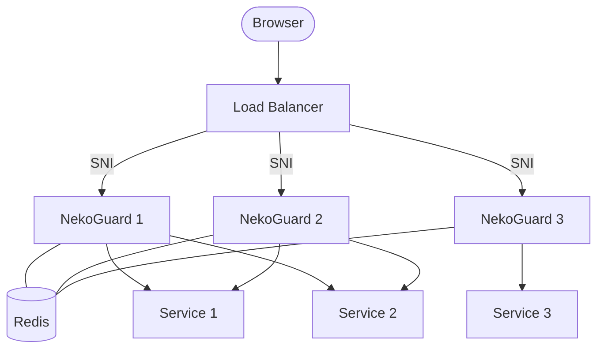
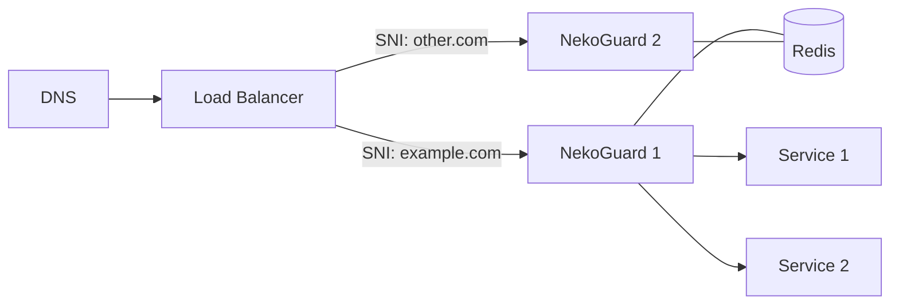

# NekoGuard

A reverse proxy in Rust that protects backend services from automated bot traffic by forcing clients to solve a Proof-of-Work challenge before access is granted. Replaces nginx as the TLS edge — auto-manages certificates, routes by domain, and blocks bots, all in one binary.

---

## Features

| Feature | Description |
|---------|-------------|
| 🔒 **Proof-of-Work** | Clients solve a SHA-256 challenge before access is granted |
| 🌐 **Auto TLS** | Let's Encrypt certificates via TLS-ALPN-01, auto-renewed |
| 🍪 **Signed Sessions** | HMAC-SHA256 signed cookies with IP binding (no replayable tokens) |
| ⚡ **Rate Limiting** | Per-IP token bucket with configurable rps/rpm/burst, per-site overrides |
| 📊 **Redis State** | Signing secret and rate limits stored in Redis — works across replicas |
| 🛡️ **SNI Allowlist** | Unknown domains are refused at the TLS handshake level |
| 🔄 **WebSocket Proxy** | Full WS proxying through the TLS edge with bidirectional piping |
| 📝 **Configurable Logging** | File output, request logging with timing, configurable levels |

---

## Architecture



> [!IMPORTANT]
> NekoGuard handles TLS termination, domain routing, and bot protection. The load balancer distributes traffic across replicas using TCP passthrough (SNI-based routing). Redis stores session state and signing secrets shared across all replicas.

---

## How It Works

1. **TLS Termination** — NekoGuard terminates TLS using auto-managed Let's Encrypt certificates
2. **SNI Routing** — Traffic is routed to the correct backend based on the domain
3. **PoW Challenge** — First-time visitors solve a SHA-256 challenge (difficulty 14 bits ≈ 16k attempts)
4. **Signed Session** — After solving PoW, a signed cookie is issued (HMAC-SHA256, IP-bound, 30-minute TTL)
5. **Rate Limiting** — Token bucket per IP with configurable limits (rps/rpm/burst)
6. **Proxying** — Authenticated traffic is proxied to the configured upstream

---

## Configuration

> [!NOTE]
> Scalar keys (`contact`, `cache_dir`, `staging`, `port`, `log`, `session`, `rate_limit`) must appear **before** any `[[sites]]` block in the TOML file. This is a TOML language requirement.

### Full Config Example

```toml
# ── ACME ──────────────────────────────────────────────────────────
contact = ["you@example.com"]         # ACME account contacts
cache_dir = "./acme-cache"            # certificate cache directory
staging = false                       # true = LE staging; false = production

# ── TLS ───────────────────────────────────────────────────────────
port = 443                            # TLS listen port
# port_http = 8080                    # optional plain-HTTP test listener

# ── Whitelist ─────────────────────────────────────────────────────
whitelist = ["127.0.0.1"]             # permanent IPs that bypass PoW

# ── Session ───────────────────────────────────────────────────────
[session]
cookie_name = "nekoguard_session"     # session cookie name
ttl = 1800                           # session duration (seconds)

# ── Rate Limiting ─────────────────────────────────────────────────
[rate_limit]
enabled = true
rps = 10                              # requests per second
rpm = 600                             # requests per minute
burst = 20                            # burst capacity

# ── Logging ───────────────────────────────────────────────────────
[log]
level = "info"                        # error, warn, info, debug
file = "/var/log/nekoguard.log"       # omit = stdout only
requests = true                      # log each request with timing

# ── Redis ─────────────────────────────────────────────────────────
[redis]
url = "redis://127.0.0.1:6379"        # session state + signing secret

# ── Backend Sites ─────────────────────────────────────────────────
[[sites]]
domain = "example.com"
upstream = "http://10.0.0.5:2368"
bypass = ["^/api/.*"]                 # skip PoW for API routes

  [[sites.sub]]
  name = "app"                        # app.example.com
  upstream = "http://10.0.0.6:8080"

  [[sites.sub]]
  name = "www"                        # inherits parent's upstream

  # Subdomain with rate limit override
  [[sites.sub]]
  name = "api"
  upstream = "http://10.0.0.7:9000"
  [site.rate_limit]
  rps = 100
  rpm = 10000
  burst = 50
```

> [!TIP]
> The `bypass` regexes are matched against the request path. Use `["^/api/.*"]` to exempt API routes, or `[".*"]` to disable PoW for an entire site. A sub's `bypass = []` overrides the parent's list and fully protects the sub.

> [!WARNING]
> Bypassed requests skip PoW entirely and are exposed to bots. Anchor patterns with `^` rather than loose substrings.

### Rate Limiting

> [!NOTE]
> Rate limits are enforced **after** a successful PoW solve. Each IP gets a token bucket that refills at `rps` tokens/second. If `rpm` is set, it acts as an additional per-minute ceiling.

Rate limits cascade: **global → domain → subdomain**. Non-zero values override:

```toml
# Global (all sites)
[rate_limit]
rps = 10
rpm = 600
burst = 20

# Domain override (applies to all subs)
[[sites]]
domain = "example.com"
upstream = "http://10.0.0.5:2368"
[site.rate_limit]
rps = 50
rpm = 5000
burst = 30

  # Sub override (overrides both global AND domain)
  [[sites.sub]]
  name = "admin"
  upstream = "http://10.0.0.8:8080"
  [site.rate_limit]
  rps = 5
  rpm = 100
  burst = 3

  # Sub without rate_limit → inherits parent domain (example.com)
  [[sites.sub]]
  name = "api"
  upstream = "http://10.0.0.7:9000"
```

### Environment Variables

| Variable | Description |
|----------|-------------|
| `NG_CONFIG` | Path to the TOML config file (default: `nekoguard.toml`) |

### Defaults

| Setting | Value |
|---------|-------|
| TLS port | 443 (+ :80 for http→https redirects) |
| PoW difficulty | 14 bits (~16k hash attempts) |
| Challenge TTL | 5 minutes |
| Session TTL | 30 minutes |
| Rate limit | Disabled by default |

---

## Deployment

### Single Server

```bash
# Build
cargo build --release

# Run (needs ports 80 + 443)
sudo setcap 'cap_net_bind_service=+ep' target/release/nekoguard
NG_REDIS_URL=redis://localhost:6379 ./target/release/nekoguard
```

> [!CAUTION]
> NekoGuard binds ports 80 and 443 directly. Run with `CAP_NET_BIND_SERVICE`, as root, or via `setcap`. DNS for every configured domain must point at this machine — that's how Let's Encrypt validates via TLS-ALPN-01.

### Multi-Replica with Load Balancer



> [!TIP]
> Use TCP passthrough (`stream { ssl_preread on; }` in nginx) on the load balancer — NekoGuard handles TLS itself. SNI-based routing in the LB distributes connections to the correct NekoGuard instance.

#### nginx Load Balancer Config

```nginx
stream {
    map $ssl_preread_server_name $backend {
        example.com    nekoguard_1;
        other.com      nekoguard_2;
        default        nekoguard_1;
    }

    upstream nekoguard_1 { server 10.0.0.1:443; }
    upstream nekoguard_2 { server 10.0.0.2:443; }

    server {
        listen 443;
        listen [::]:443;
        proxy_pass $backend;
        ssl_preread on;
    }
}
```

> [!IMPORTANT]
> The load balancer must use **TCP passthrough** (not HTTP termination) so NekoGuard can handle TLS itself and Let's Encrypt can validate via TLS-ALPN-01.

---

## Redis

> [!NOTE]
> Redis is required for multi-replica deployments. For a single server, Redis still stores the signing secret but rate limiting works in-memory.

```toml
# In nekoguard.toml or via NG_REDIS_URL
NG_REDIS_URL=redis://127.0.0.1:6379
```

**What Redis stores:**
- `nekoguard:secret` — HMAC signing secret (shared across all replicas)
- Rate limit state (currently in-memory; will move to Redis for multi-replica support)

---

## TLS Certificates

> [!TIP]
> Start with `staging = true` to avoid burning Let's Encrypt production rate limits. Switch to `staging = false` once you've confirmed certs are issued successfully.

Certificates are obtained via **TLS-ALPN-01** — NekoGuard answers ACME validation challenges directly on port 443. No HTTP server needed for certificate renewal.

- Certificates are cached in `cache_dir` (default: `./acme-cache`)
- Auto-renewed before expiry
- Unknown domains are refused at the TLS handshake level

---

## Rate Limiting Details

After solving PoW, each IP gets a **token bucket** with configured capacity. Tokens refill at `rps` rate. If `rpm` is set, it acts as a per-minute ceiling.

| Parameter | Default | Description |
|-----------|---------|-------------|
| `enabled` | false | Enable rate limiting |
| `rps` | 10 | Max requests per second |
| `rpm` | 600 | Max requests per minute |
| `burst` | 20 | Burst capacity above rps |

When exceeded: `429 Too Many Requests`

---

## Session Cookies

Sessions are signed with **HMAC-SHA256** and bound to the client IP:

```
nekoguard_session=<ip>.<expiry_hex>.<nonce_hex>.<hmac_hex>
```

- **IP-bound** — cookie is invalid from a different IP
- **Time-limited** — expires after `session.ttl` seconds (default: 1800)
- **Cryptographically signed** — prevents forgery
- **Secret stored in Redis** — shared across replicas

> [!CAUTION]
> The signing secret is generated once and stored in Redis. Deleting the `nekoguard:secret` key invalidates all sessions — all users must re-solve PoW.

---

## Project Structure

```
src/
├── main.rs          # TLS edge, request handler, proxy logic
├── config.rs        # TOML config parsing, site expansion
├── session.rs       # HMAC-signed session cookies, Redis secret
├── ratelimit.rs     # Token bucket rate limiting
├── pow.rs           # SHA-256 PoW: challenge gen, verify, sweep
├── ng_log.rs        # Custom logger with file output
├── challenge.html   # Client-side PoW page (minified at build)
└── assets/          # Embedded static assets
```
